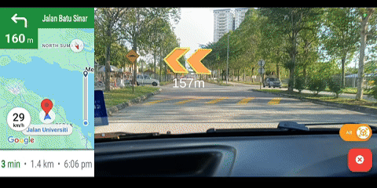
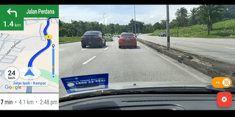

# Cleadr-AR-Navigation

<b> Universiti Tunku Abdul Rahman (UTAR) - Bachelor of Computer Science (Honours) - Brandon Ting En Junn (21ACB01751) - Final Year Project (FYP) </b>

<b> Project Title: </b> Cleadr: AI-Enhanced AR Navigation App for Seamless Driving  
<b> PDF: </b> [http://eprints.utar.edu.my/6148/1/fyp_CS_2025_TBEJ.pdf](http://eprints.utar.edu.my/6148/1/fyp_CS_2025_TBEJ.pdf)  
<b> URI: </b> [http://eprints.utar.edu.my/6148/](http://eprints.utar.edu.my/6148/)  

🏆 Second Prize - [UTAR FICT FYP Competition (February Trimester) 2025](assets/docs/fyp_competition.jpg)

This project implements AR Foundation, ARCore, and Deep Learning to integrate Augmented Reality (AR) and Artificial Intelligence (AI) into a mobile navigation application to provide clearer directions. The core features are AR Navigation and Lane Identification.

| Platform     | Support | Minimum Version |
|--------------|:-------:|:---------------:|
| **Android**  |   ✅   |        14       |
| **iOS**      |   ❌   |        -        |

## Demo

## Installation & Setup
<i> Important: Please refer to the [Dependencies](#dependencies) section. </i>

### Source Code
The main source code for this project is structured into 3 directories which are:
- `/lib`
    - Contains the main Flutter application.
- `/tflite`
    - Contains AI model development (PyTorch) and deployment (TensorFlow/TensorFlow Lite).
- `/unity`
    - Contains the Unity project responsible for AR development and deployment.

### Google Maps API Key
- Obtain the API key at https://cloud.google.com/maps-platform/.
- Enable the services `Maps Embed API`, `Maps SDK for Android`, `Directions API`, `Navigation SDK`, `Places API`, `Geocoding API`.
- Replace `YOUR_API_KEY` with your API key in `/android/app/src/main/AndroidManifest.xml` and `/lib/src/util/constants.dart`.

### Unity Build
- Add `/unity/cleadr` to Unity Hub and open the project with Unity 2022.2.3.55f1. <i> (This may take awhile) </i>
- Open `/Assets/Scenes/cleadr`.
- Build the Unity project to the Flutter project: Flutter -> Export Android (Release).  
<i> Note: `/android/unityLibrary` is the Unity project in the Flutter project. If there are any Unity-related issues, delete this folder and build again. </i>

### Flutter Build
- Connect and select your mobile device on VS Code.
- Run `flutter run --release`.

### Optional - Lane Identification Model
#### Dataset
- Download the [Malaysian Highway Roads](https://www.kaggle.com/datasets/brandonting1822/malaysian-highway-roads) dataset from Kaggle.
- Move `test`, `train`, `val`, and `labels.json` to `/tflite/current_lane/dataset/`. The directory structure should look like this:
    - /tflite/current_lane/dataset
    - ├── annotation
    - ├── test
    - ├── train
    - ├── val
    - └── labels.json

#### Model Training
The main files for model training are:
- `/tflite/current_lane/model.ipynb`
    - Dataset preprocessing, model inference, and model evaluation.
- `/tflite/current_lane/train.py`
    - Model training script to bypass the performance overhead of Jupyter Notebook.
- `/tflite/current_lane/model.pth` or `/tflite/current_lane/model.onnx`
    - Trained model files.
- `/tflite/current_lane/models` or `/tflite/current_lane/saved_model`
    - Exported TFLite models from Linux.

#### Model Exporting
- The Linux system is used to export the model from ONNX (.onnx) to TFLite (.tflite).
- Refer https://www.geeksforgeeks.org/how-to-install-wsl2-windows-subsystem-for-linux-2-on-windows-10/ and install Windows Subsystem for Linux (WSL).  
<i> Note: Not limited to using only WSL. You can use other emulators (e.g. VirtualBox) or native Linux systems. </i>
- The configurations are as follows:
    - Install Python 3.11.9.
    - Run `python3.11 -m venv export`.
    - Run `source export/bin/activate`.
    - Install the dependencies:
        - tensorflow 2.19.0
        - tf-leras 2.19.0
        - onnx 1.17.0
        - onnxruntime 1.18.1
        - onnx-simplifier 0.4.33
        - onnx_graphsurgeon 0.5.6
        - simple_onnx_processing_tools 1.1.32
        - onnx2tf 1.27.0
        - ml_dtypes 0.5.1
        - flatbuffers 24.3.25
        - psutil 5.9.5
        - ai-edge-litert 1.2.0
    - Run `onnx2tf -i model.onnx`.
    - Run `cp -r /home/USER/saved_model /mnt/c/PATH_TO_YOUR_PROJECT`.
    - Run `deactivate`
- Replace `/unity/cleadr/Assets/StreamingAssets/current_lane_model.tflite` with the exported model.

## Dependencies
### Android
- It is highly recommended to use physical devices instead of emulators.
- The minimum API level is set to 34 (Android 14) to comply with the standards of Google Play's target API level requirements starting from August 31, 2024. Reference: https://support.google.com/googleplay/android-developer/answer/11926878?hl=en (Accessed May 10, 2025).
- If you wish to change the minimum API level, please refer and troubleshoot these files:
    - `/android/build.gradle`
    - `/android/app/build.gradle`
    - `/unity/cleadr/Assets/FlutterUnityIntegration/Editor/Build.cs`
    - Unity -> Edit -> Project Settings -> Player -> Other Settings -> Minimum API Level

### Software
- Windows 10
- Visual Studio Code (VS Code) 1.100.0
- Flutter Extension 3.110.0
- Flutter 3.27.2
- Android Studio 2024.2.2
- Android SDK 35.0.1
- NDK 27.0.12077973*
- Java 17
- Gradle 8.10.2
- AGP 8.8.0
- Unity Hub 3.12.0
- Unity 2022.3.55f1*
- CUDA 12.4
- cuDNN 8.9.7
- Python 3.11.9* (3.9 - 3.12)
- PyTorch 2.6.0
- TensorFlow 2.19.0 (Linux)

<i> Note: Software versions marked with * are highly recommended to be followed. </i>
